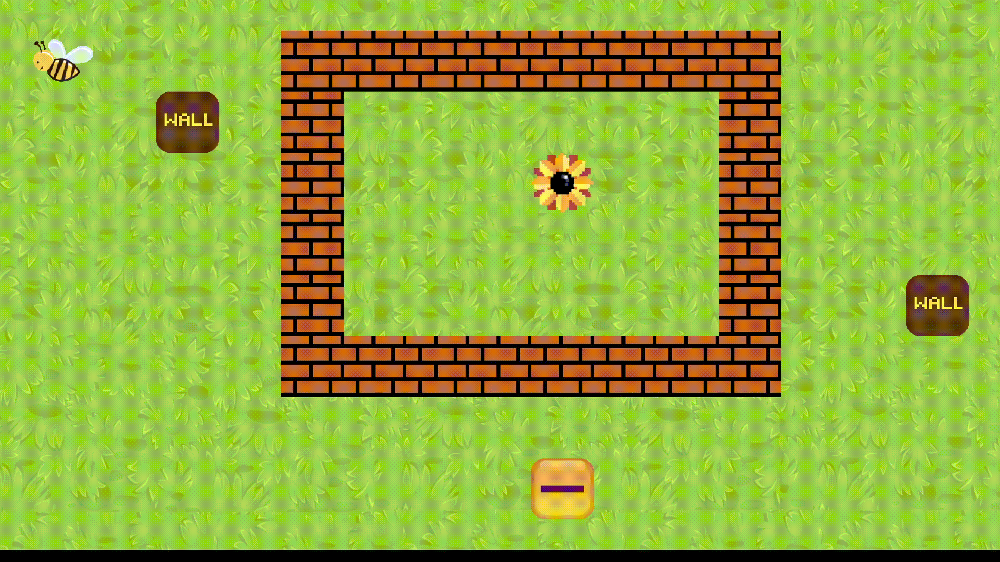

# Flower is Win

# Author

* Sarah Brood (sarah.brood@ecole.ensicaen.fr)
* Adrien David (adrien.david@ecole.ensicaen.fr)
* Benjamin Deschamps (benjamin.deschamps@ecole.ensicaen.fr)
* Alexis Dupont (alexis.dupont@ecole.ensicaen.fr)

# Requirements
The project relies on the following dependencies
* Cmake 2.8
* OpenGL 4.1
* GLFW 3.0
* GLM 0.9.2

**Note:** Missing dependencies will be automatically added as git submodules.


# Instructions
## Building
To build the project, run the following commands :
```bash
mkdir build
cd build
cmake .. -DCMAKE_BUILD_TYPE=RELEASE
make flower
```

## Running
To run the project, run the following commands :
```bash
./flower
````

# Demo



# Controls
## Keyboard
* Use the arrows to move
* Esc, to quit

# Game's Rules
## Goal
Reach the flower with Beebi (the bee). To do so, move the blocks to solve the level.
## Blocks
**Those blocks are movable, you can use them with Operators to interact with the environment. There are several type of blocks :**


### Wall :

This block interact with the walls.


## Operators :

**The operators are used with the Blocks. They are also movable. There are three of them :**

### Operator - :

This operator subtracts a property to another.

# Author and License
The code is published under the MIT License (MIT)

* Copyright (c) 2021 Sarah Brood
* Copyright (c) 2021 Adrien David
* Copyright (c) 2021 Benjamin Deschamps
* Copyright (c) 2021 Alexis Dupont


Permission is hereby granted, free of charge, to any person obtaining a copy
of this software and associated documentation files (the "Software"), to deal
in the Software without restriction, including without limitation the rights
to use, copy, modify, merge, publish, distribute, sublicense, and/or sell
copies of the Software, and to permit persons to whom the Software is
furnished to do so, subject to the following conditions:

The above copyright notice and this permission notice shall be included in all
copies or substantial portions of the Software.

THE SOFTWARE IS PROVIDED "AS IS", WITHOUT WARRANTY OF ANY KIND, EXPRESS OR
IMPLIED, INCLUDING BUT NOT LIMITED TO THE WARRANTIES OF MERCHANTABILITY,
FITNESS FOR A PARTICULAR PURPOSE AND NONINFRINGEMENT. IN NO EVENT SHALL THE
AUTHORS OR COPYRIGHT HOLDERS BE LIABLE FOR ANY CLAIM, DAMAGES OR OTHER
LIABILITY, WHETHER IN AN ACTION OF CONTRACT, TORT OR OTHERWISE, ARISING FROM,
OUT OF OR IN CONNECTION WITH THE SOFTWARE OR THE USE OR OTHER DEALINGS IN THE
SOFTWARE.
